# IamACloudCaptain

## Project Description


**"IamACloudCaptain"** is an inclusive repository aiming to provide a centralized platform for individuals seeking opportunities in the DevOps/Cloud domain. The project's primary goal is to facilitate a space where job seekers can add their professional details, enabling recruiters and organizations to discover potential talents easily.

## Mission and Goals

- **Central Hub for Job Seekers:** To serve as a unified hub where individuals interested in DevOps/Cloud roles can showcase their skills and credentials.

- **Enhanced Visibility:** Enable contributors to add their professional details, including their name, GitHub handle, current location, current company, role/designation, key skills, specific roles of interest, and a link to their CV/Resume.

- **Community Collaboration:** Foster collaboration within the DevOps/Cloud community by providing an open space for job seekers to connect, share insights, and explore career opportunities.

## Structure and Guidelines

### Adding Your Information

To contribute to the **"IamACloudCaptain"** project, follow these steps:

1. **Fork the Repository:** Click on the "Fork" button to create a copy of the repository in your GitHub account. 

    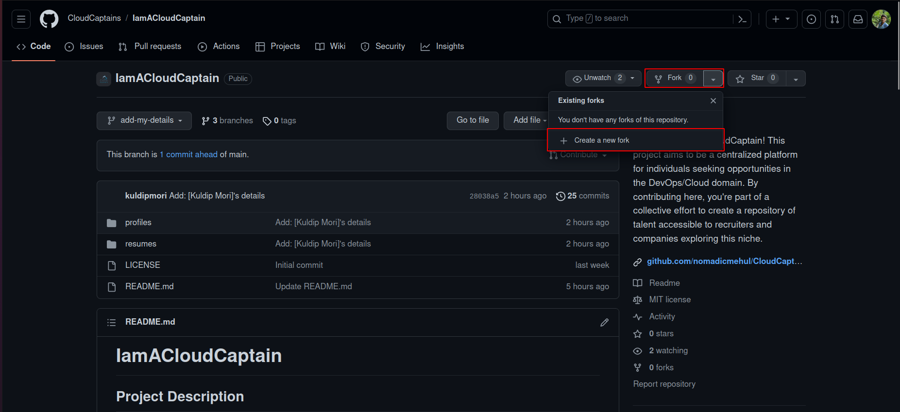

2. **Form with Main branch:** Verify that you are only attaching fork from the main branch.

    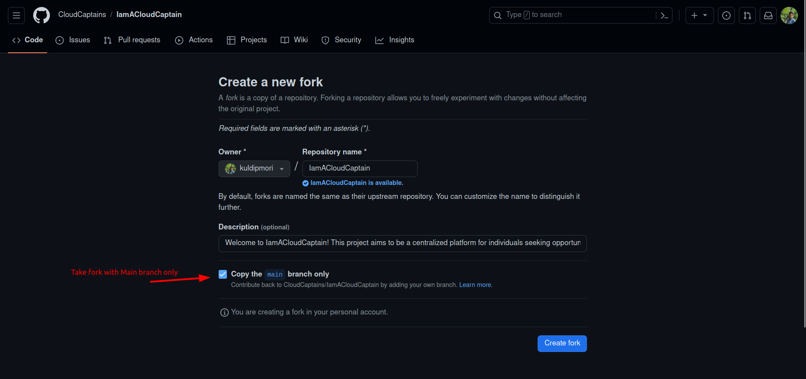

3. **Clone the Repository:** Clone the forked repository to your local machine.
    ```bash
    git clone https://github.com/your-username/IamACloudCaptain.git
    ```

    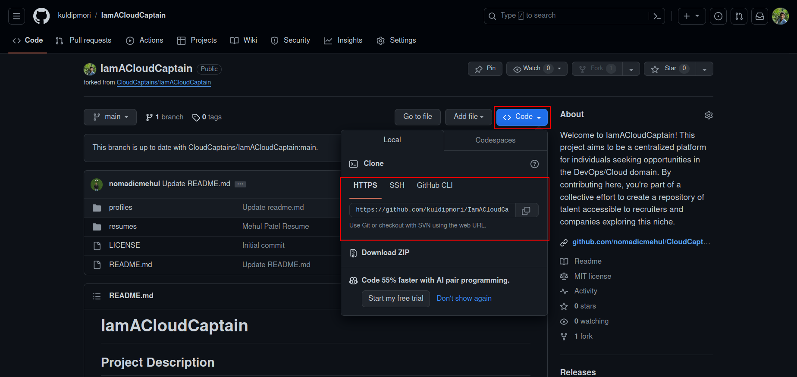

4. **Code Clone:** Make sure you are use main branch.

    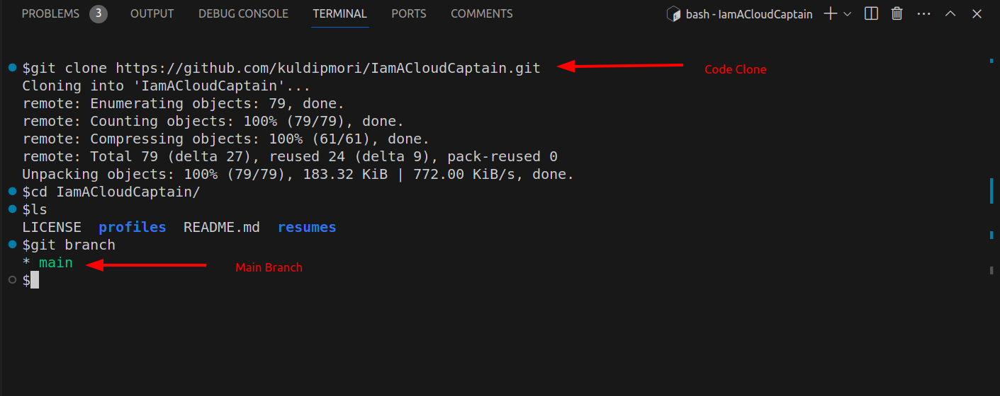

5. **Working Folder:** Navigate to the `resume` folder and update the 'readme.md' file. In the provided table, ensure your profile details are accurate and original information.

    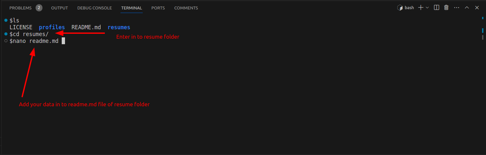

6. **Update Resume:** Updated Resume, move or copy it to the `resume` folder. Ensure the resume is in `.pdf` format only.

    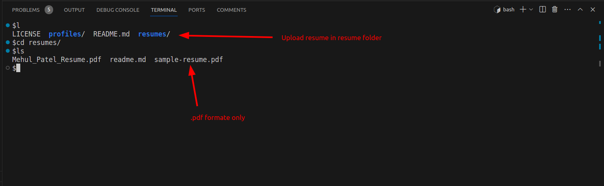

7. **Profile URL Details:** "Ensure that the provided `GitHub-Profile`, `Current-Role`, `LinkedIn-Profile`, and `Joining-Date` are accurate."

    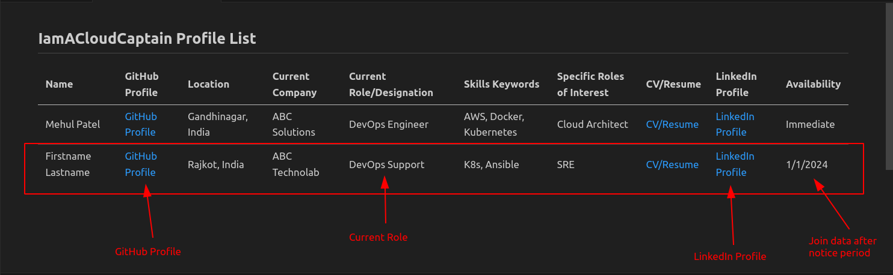

8. **Upload Data:** After uploading your resume and updating the readme.md file in the resume folder, ensure to commit and push all the changes to GitHub. 

    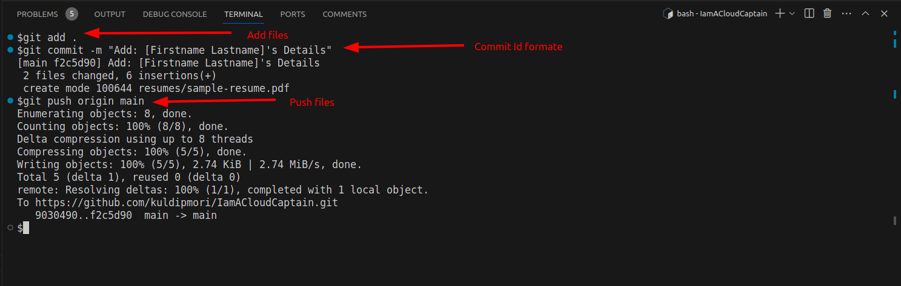

9. **Create pull request:** After completing the updates, create a pull request to merge the changes into the main branch.

    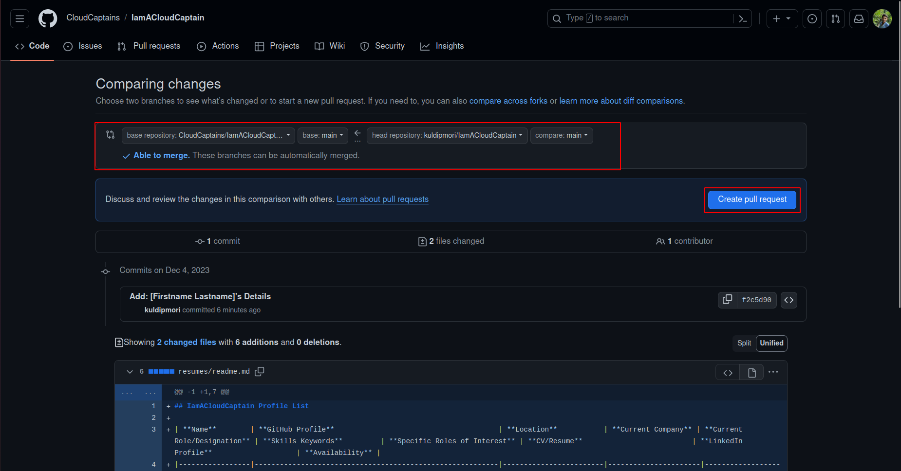


10. **Comment for merge:** Crate Comment with this formate and add few details about your profile and Create pull request.

    ```bash
    # For tital

    Add: [Firstname - Lastname]'s details
    ```

    ```
    For Description

    - Working technology experience.
    - Total experience.
    ...
    ```

    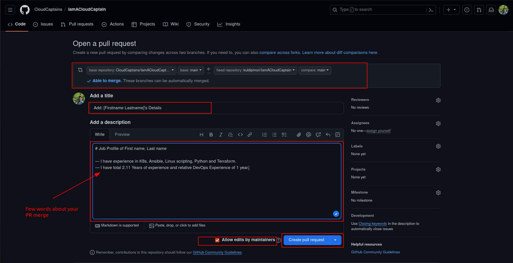

11. **Confirm Merge:** Confirm the merge and commit for the merge, ensuring that you grant access with "Allow edits by maintainers."

    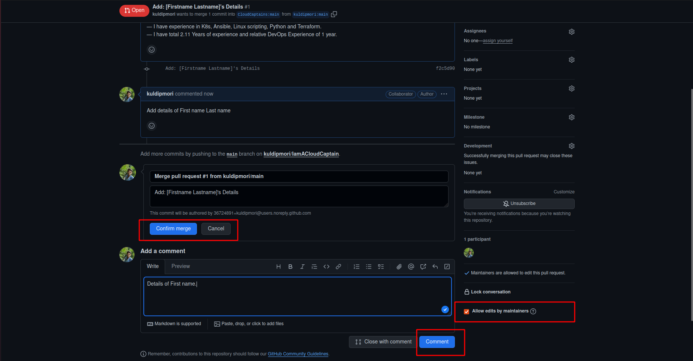


## Data Format

| **Name**        | **GitHub Profile**                                       | **Current Location**           | **Current Company** | **Current Role/Designation** | **Skills Keywords**         | **Specific Roles of Interest** | **CV/Resume**                          | **LinkedIn Profile**                    | **Availability** |
|-----------------|----------------------------------------------------------|------------------------|----------------------|------------------------------|-----------------------------|------------------------------------|---------------------------------------|---------------------------------------|-------------------|
| Mehul Patel      | [GitHub Profile](https://github.com/nomadicmehul/)      | Gandhinagar, India     | ABC Solutions         | DevOps Engineer              | AWS, Docker, Kubernetes    | Cloud Architect                    | [CV/Resume](./resumes/Mehul_Patel_Resume.pdf) | [LinkedIn Profile](linkedin_profile_link) | Immediate        |
| Jane Smith       | [GitHub Profile](link)                                   | San Francisco, USA     | XYZ Corporation       | Cloud Architect              | Azure, Terraform            | DevOps Engineer                    | [CV/Resume](link)                       | [LinkedIn Profile](linkedin_profile_link) | 2 months notice   |
| ...             | ...                                                      | ...                    | ...                  | ...                          | ...                         | ...                                | ...                                   | ...                                   | ...               


In this updated table, the `CV/Resume` field contains a link pointing to the `resumes` folder where each contributor's CV/Resume document is stored. Replace `sample-resume.pdf` with the actual file name of the respective contributor's CV/Resume document within the `resumes` folder. This structure ensures that each contributor's document is stored separately and linked from the main table in the README file.

### Guidelines for Adding Details

- **Accuracy:** Ensure the information added is accurate and up-to-date.
- **Respect Privacy:** Avoid sharing sensitive information.
- **Structured Format:** Use the provided template for consistency and easy reference.

## Contribution Guidelines

Contributions to the **"IamACloudCaptain"** project are welcome! Feel free to suggest improvements, enhancements, or additional features by creating issues or submitting pull requests.

### Reporting Issues

If you encounter any issues or have suggestions for enhancements, please open an issue on GitHub, providing detailed information about the problem or suggestion.

### Pull Requests

When submitting a pull request, please ensure it addresses a specific issue, follows the repository's structure and guidelines, and provides a clear explanation of the changes made.

## **Join Our Community!** 🚀

Whether you're exploring job opportunities, seeking skilled professionals, or looking to network with like-minded individuals, "[Cloud Captain](https://t.me/CloudCaptains)" welcomes your participation:

- **Contributors:** Job seekers interested in DevOps/Cloud roles are encouraged to add their professional details to the repository. Follow the guidelines in the README.md to include your information and become a part of our growing network of talented individuals.

- **Recruiters/Employers:** Discover potential talents and connect with individuals actively seeking opportunities in the DevOps/Cloud domain. Explore the profiles added by contributors to find the right fit for your team.

- **Community Engagement:** Engage with fellow contributors, share insights, and collaborate on projects within the realm of DevOps and Cloud technologies. Discussions, feedback, and contributions are all valuable to our community's growth.

#### Benefits of Joining

By becoming a part of the **"Cloud Captain"** community, you'll:

- **Expand Your Network:** Connect with professionals in the industry, broaden your connections, and explore new opportunities.

- **Showcase Your Expertise:** Highlight your skills and expertise in DevOps/Cloud technologies to potential employers or collaborators.

- **Discover Opportunities:** Gain visibility among recruiters and employers seeking talents in the DevOps/Cloud domain.

#### Contribution Guidelines

To contribute to the "[Cloud Captain](https://github.com/nomadicmehul/CloudCaptain)" project, follow the guidelines outlined in the README file. Your participation contributes to the enrichment of our community and provides valuable resources.

Let's build a vibrant and supportive community together! Join us on this exciting journey into the world of DevOps and Cloud technologies. 🌐✨

## 🛡️ License

This project is licensed under the **MIT License** - see the [LICENSE](LICENSE) file for details.
